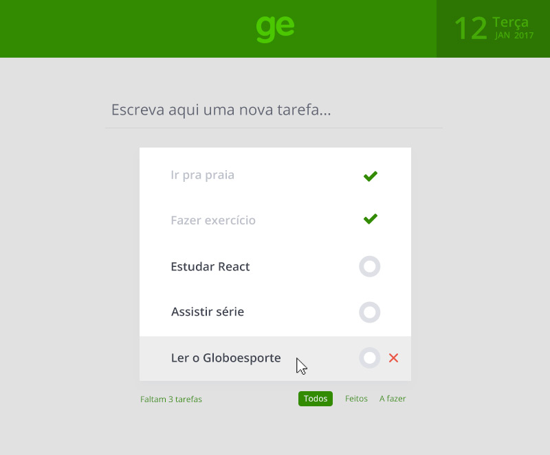

# Desafio Globoesporte

Desenvolva uma aplicação de tarefas (todo list) utilizando React.

Crie um fork desse projeto, e quando concluído crie um pull request do seu fork para esse repositório.

---

## Features

O usuário deve poder:

- Inserir tarefas
- Remover tarefas
- Editar o texto das tarefas
- Filtrar os items de acordo com o estado (Todos, Feitos, A fazer)
- Marcar uma tarefa como feita (done) ou não feita

---

## Layout

De preferência seguir o layout abaixo para a criação da aplicação, o PSD se encontra dentro da pasta `layout`:

---

## Dados

Na pasta `api/data.json` existe um array de items, que é o estado inicial que a aplicação deve ter.

A partir do estado inicial, as ações de adicionar, remover e editar items devem se dar localmente no JS sem persistir estado.

Cada item da lista só pode ter dois status, `done` ou `todo`.

Para esse desafio não é necessário guardar as modificações que o usuário vai fazer na aplicação.

---

## Comandos que o projeto deve ter

Dependências do projeto devem ser instaladas com:

`npm install`

A aplicação deve ser executada com:

`npm start`

---

*Bônus:*

Testes unitários automatizados devem ser executados com:

`npm test`
